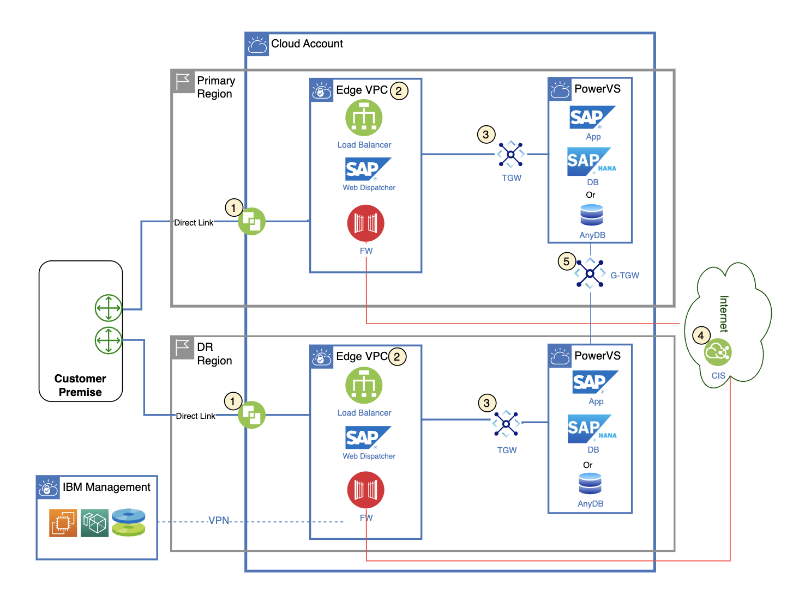
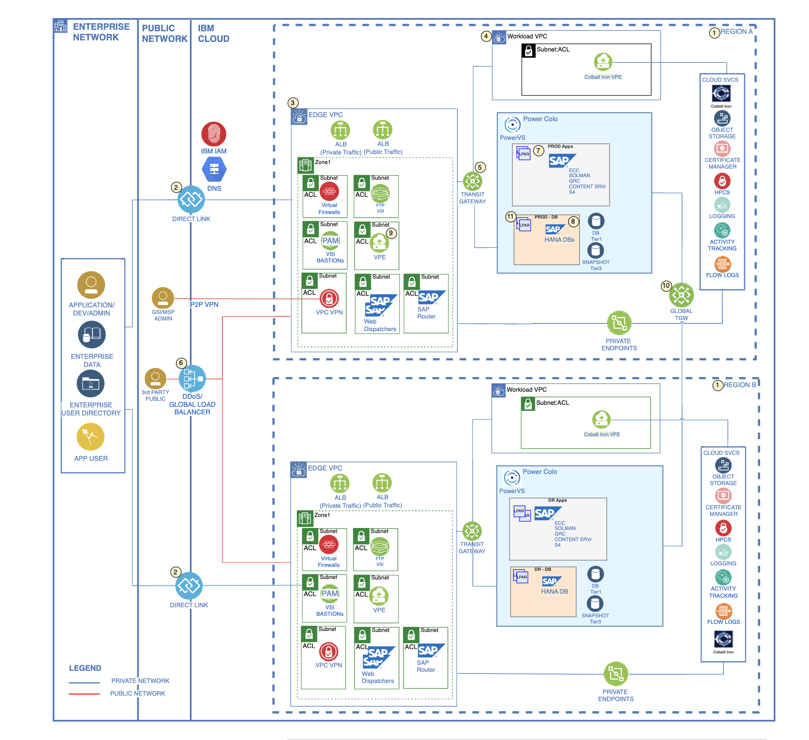

---

copyright:
  years: 2024
lastupdated: "2024-11-12"

subcollection: pattern-sap-on-powervs
keywords:

---

{{site.data.keyword.attribute-definition-list}}

# SAP on Power Virtual Server
{: #sap-on-powervs}
{: toc-content-type="reference-architecture"}
{: toc-version="1.0"}

The primary region supports Production workloads on Power Virtual Server. The secondary region supports nonproduction and disaster recovery workloads should the customer have DR requirements. The components deployed to the Edge VPC provide security functions and resource isolation to the IBM Cloud workloads.

Figure 1 illustrates a high level architecture for a single-zone, multi-region deployment on IBM Cloud Power Virtual Server.

## Architecture Diagram
{: #architecture-diagram}

{: caption="SAP Single-zone, multi-region deployment on IBM Cloud PowerVS" caption-side="bottom"}

1. Client network connectivity is accomplished through Direct Link with VPN access for MSPs.

2. An Edge VPC is deployed which contains routing and security functions.

3. Transit Gateway to Power Virtual Server hosting the SAP application and databases

4. Public connectivity also routes through Cloud Internet Services (CIS) which can provide load balancing, failover, and DDoS services, then routes to the edge VPC

5. Global Transit Gateway connecting the PowerVS environment across regions to facilitate replication for DR purposes.

Figure 2 illustrates a detailed architecture for a single-zone, multi-region deployment on IBM Cloud Power Virtual Server.

{: caption="A single-zone, multi-region deployment to facilitate disaster recovery" caption-side="bottom"}

### Architecture description
{: #architecture-description}

1. Two separate IBM Cloud regions, one for Primary workload and the other for Disaster Recovery. If Cost Optimized Disaster Recovery is considered, some Non Production systems may share the same compute with Disaster Recovery systems.

2. Enterprise network connectivity from On-premise to IBM Cloud is accomplished through Direct Links. 

3. An Edge VPC is deployed which contains routing and security functions. For security purposes, all ingress and egress traffic will route through the Edge VPC. It contains an sFTP server, Bastion host (jump), Firewalls providing advanced security functions and the SAP router and Web Dispatcher.

4. Besides Power Workloads in Power workspace, x86 workloads may be implemented in a Workload VPC. To backup Power workloads, Secure Automated Backup with Compass by Cobalt Iron is implemented. The private end point for this backup service is located in VPC.

5. VPCs are connected to Power workspace through a local Transit Gateway.

6. Public connectivity routes through Cloud Internet Services which can provide global load balancing, failover, and DDoS services, then routes to the VPC Landing Zone.

7. SAP workloads may be hosted on redundant SAP certified LPARS in PowerVS.

8. SAP Application and SAP HANA should be placed on SAP certified LPARs within the zone with proximity considered.

9. Virtual Private endpoints are used to provide connectivity to cloud native services.

10. Global Transit Gateway connecting PowerVS across regions for data replication purposes between the two regions.

11.	To achieve 99.95% infrastructure availability, multiple LPARs in the same placement group within a zone can be implemented.

## Design scope
{: #design-scope}

Design decisions that need to be considered for an end-2-end SAP on
PowerVS deployment and which are covered in this accelerator include:

- **Compute:** Bare Metal and Virtual Servers
- **Storage:** Primary, Backup, and Archive
- **Networking:** Enterprise Connectivity, Edge Gateways, Segmentation and Isolation, Cloud Native Connectivity and Load Balancing
- **Security:** Data, Identity and Access Management, Infrastructure and Endpoint, Threat Detection and Response
- **Resiliency:** Backup and Restore, Disaster Recovery, High Availability
- **Service Management:** Monitoring, Logging, Alerting, Management/Orchestration

The Architecture Framework, described in [Introduction to the Architecture
Framework](/docs/architecture-framework?topic=architecture-framework-intro),
provides a consistent approach to designing cloud solutions by
addressing requirements across a pre-defined set of aspects and
domains, which are technology-agnostic architectural areas that need
to be considered for any enterprise solution. It can be used as a guide
to make the necessary design and component choices to ensure the
applicable requirements for each aspect and domain have been
considered.

{: caption="Domains that are covered in this solution" caption-side="bottom"}

## Requirements
{: #requirements}

The following represents a baseline set of requirements, which we believe are applicable to most clients and critical to a
successful SAP deployment.

| Aspect         | Requirement                                                         |
|---------------------------------|----------------------------------------------------------------------------------------------------------------------------------------------------------------------------------------------------------------------------------------|
| Network            | Enterprise connectivity to customer data centers to provide access to applications from on-premises                                                                                                                                                                                                                                    |
|                    | Map and convert existing customer SAP Network functions into IBM Cloud and PowerVS networking services                                                                                                                                                                                                                            |
|                    | Migrate/Redeploy customer IP addressing scheme within the IBM Cloud environment                                                                                                                                                                                                                                                       |
|                    | Provide network isolation with the ability to segregate applications based on attributes such as data classification, public versus internal apps, and function                                                                                                                                                                            |
| Security           | Provide data encryption in transit and at rest                                                                                                                                                                                                                                                                                        |
|                    | Migrate customer IDS/IAM Services to target IBM Cloud environment                                                                                                                                                                                                                                                                     |
|                    | Retain the same firewall rulesets across existing DCs                                                                                                                                                                                                                                                                                 |
|                    | Firewalls must be restrictively configured to provide advanced security features and prevent all traffic, both inbound and outbound, except that which is required, documented, and approved, and include IPS/IDS services                                                                                               |
| Resiliency         | Multi-site capability to support a disaster recovery strategy and solution using IBM Cloud infrastructure DR capabilities                                                                                                                                                                                                        |
|                    | Provide backups for data retention                                                                                                                                                                                                                                                                                                    |
|                    | RTO/RPO = 4 hours/15 minutes; Rollback to original environments should occur no later than specified RTOs                                                                                                                                                                                                                             |
|                    | 99.95 Availability                                                                                                                                                                                                                                                                                                                    |
|                    | Backups  \n  * Prod: Daily Full, logs per SAP product standard, 30 days retention.  \n   *  Non-Prod: Weekly full, logs per SAP product standard, 14 days retention time.                                                                                                                                                                          |
| Service Management | Provide Health and System Monitoring with ability to monitor and correlate performance metrics and events and provide alerting across applications and infrastructure                                                                                                                                                                 |
|                    | Ability to diagnose issues and exceptions and identify error sources                                                                                                                                                                                                                                                                  |
|                    | Automate management processes to keep applications and infrastructure secure, up to date, and available                                                                                                                                                                                                                               |
| Other              | Migrate SAP workloads from existing data center to IBM PowerVS                                                                                                                                                                                                                                                                        |
|                    | Customer's SAP systems and applications that are run on NetWeaver (application) and HANA (DB), AnyDB, or S/4 HANA                                                                                                                                                                                                                                 |
|                    | Provide an Image Replication migration solution that minimizes disruption during cut-over                                                                                                                                                                                                                                        |
|                    | Cloud infrastructure for the proposed IaaS solution must be SAP Certified                                                                                                                                                                                                                                                             |
|                    | IBM Cloud IaaS is deployed to support SAP and surrounding non-SAP workloads                                                                                                                                                                                                                                                      |
|                    | The customer does not want to adopt [RISE](https://www.ibm.com/consulting/rise-with-sap?utm_content=SRCWW&p1=Search&p4=43700077624079785&p5=e&gclid=EAIaIQobChMIr9bRlt7LgQMVJdHCBB0cewwcEAAYASAAEgIVgfD_BwE&gclsrc=aw.ds) at this time but wants to consider a Cloud deployment solution that would facilitate a future RISE transformation |
{: caption="Requirements" caption-side="bottom"}

## Components
{: #components}

| Aspects                       | Solution components                                                                                                                                                                                    | How the component is used                                                              |
|-------------------|--------------------------------------------------------------------------------------------------------------------------------------------|-------------------------------------------------------------------------------------------------------------------|
| Compute                            | [VPC VSIs](https://cloud.ibm.com/vpc-ext/provision/vs)                                                                                                                                        | Edge VPC                                                 |
|                                    | Bare Metal ([IBM Storage Protect](https://www.ibm.com/support/pages/node/6498661))                                                                                                                          |IBM Storage Protect(BM)|
|                                    | [Power Virtual Server](https://cloud.ibm.com/docs/sap?topic=sap-fast-path-site-map-power-vs)                                                                                                                |NetWeaver and HANA DB|
| Storage                            | Flash storage from IBM FS9000 series devices                                                                                                                                                                | NetWeaver and HANA DB servers primary storage production on Tier 1. Non-Production on Tier 3.               |
|                                    | [Cloud Object Storage](https://cloud.ibm.com/docs/cloud-object-storage?topic=cloud-object-storage-about-cloud-object-storage)                                                                 | Backup and archive, application logs, operational logs, and audit logs                                       |
|                                    | [Block storage](https://cloud.ibm.com/docs/vpc?topic=vpc-block-storage-about&interface=ui)                                                                                                                  |                                                                                                             |
| Networking                         | [VPC Virtual Private Network (VPN)](https://cloud.ibm.com/docs/iaas-vpn?topic=iaas-vpn-getting-started)                                                                                                     | Remote access to manage resources in a private network                                                        |
|                                    | [Virtual Private Gateway & Virtual Private Endpoint (VPE)](https://cloud.ibm.com/docs/vpc?topic=vpc-about-vpe)                                                                                | For private network access to Cloud Services, for example Key Protect, Cloud Object Storage, and so on.                                   |
|                                    | [Cloud Internet Services (CIS)](https://cloud.ibm.com/docs/cis?topic=cis-getting-started)                                                                                                                   | Public Load balancing and DDoS of web servers traffic across zones in the region                            |
|                                    | [DNS Services](https://cloud.ibm.com/docs/dns-svcs?topic=dns-svcs-about-dns-services)                                                                                                         | Domain Naming System services                                                                               |
|                                    | [VPCs and subnets](https://cloud.ibm.com/docs/vpc?topic=vpc-about-subnets-vpc&interface=ui)                                                                                                                 | Network Segmentation/Isolation                                                                              |
|                                    | [Transit Gateway](https://cloud.ibm.com/docs/transit-gateway?topic=transit-gateway-about)                                                                                                                   | Connects across VPC, PowerVS, and Classic                                                                    |
|                                    | [IBM Cloud Application Load Balancer](https://cloud.ibm.com/docs/vpc?topic=vpc-load-balancers-about) (ALB)                                                                                                  | Load balancing workloads across multiple workload instances over the private network                        |
|                                    | SAP Web Dispatcher                                                                                                                                                                                          |                                                                                                             |
| Security                           | [Block Storage encryption](https://cloud.ibm.com/docs/vpc?topic=vpc-mng-data&interface=ui) with provider keys                                                                                 | Block Storage Encryption at rest                                                                            |
|                                    | Cloud Object Storage Encryption                                                                                                                                                                             | Cloud Object Storage Encryption at rest                                                                     |
|                                    | PowerVS Tier 1 or Tier 3 storage                                                                                                                                                                              | Power VS uses IBM FlashSystem Storage with AES-256 (Advanced Encryption Standard) hardware-based encryption |
|                                    | HANA Data Volume Encryption (DVE)                                                                                                                                                                           | HANA Database Encryption at rest                                                                            |
|                                    | [IAM](https://cloud.ibm.com/docs/account?topic=account-cloudaccess)                                                                                                                           | IBM Cloud Identity & Access Management                                                                      |
|                                    | Privileged Identity and Access Management                                                                                                                                                                   | BYO Bastion host (or Privileged Access Gateway) with PAM SW deployed in Edge VPC                            |
|                                    | [BYO Bastion Host on VPC VSI with PAM SW](https://cloud.ibm.com/docs/framework-financial-services?topic=framework-financial-services-vpc-architecture-connectivity-bastion-tutorial-teleport) | Remote access with Privileged Access Management                                                             |
|                                    | [Virtual Private Clouds (VPCs), Subnets, Security Groups, ACLs](https://cloud.ibm.com/docs/vpc?topic=vpc-getting-started)                                                                     | Core Network Protection and isolation                                                                       |
|                                    | Isolated PowerVS LPARs                                                                                                                                                                                      |                                                                                                             |
|                                    | [Cloud Internet Services (CIS)](https://cloud.ibm.com/docs/cis?topic=cis-getting-started)                                                                                                                   | DDoS protection and Web App Firewall                                                                        |
|                                    |Choose one of the following: \n  - [Fortigate](https://cloud.ibm.com/catalog/content/ibm-fortigate-AP-HA-terraform-deploy-5dd3e4ba-c94b-43ab-b416-c1c313479cec-global)  \n  - [Palo Alto](https://cloud.ibm.com/catalog/content/ibmcloud-vmseries-1.9-6470816d-562d-4627-86a5-fe3ad4e94b30-global)                                                      |IPS/IDS protection at all ingress/egress \n Unified Threat Management (UTM) Firewall                                                                |
| Resiliency                         | HANA System Replication (HSR)                                                                                                                                                                               | Provide 99.95% availability for HANA DB                                                                     |
|                                    | [IBM Storage Protect](https://cloud.ibm.com/media/docs/downloads/power-iaas/PowerVS_AIX_Backup_Performance_Best_Practices_and_Guidelines_v1_0_03012022.pdf)                                                 | Backups and restores for images and file systems.                                                           |
|                                    | [GRS](https://cloud.ibm.com/docs/power-iaas?topic=power-iaas-getting-started-GRS)                                                                                                                           |                                                                                                             |
|                                    | DBACOCKPIT, HANACOCKPIT, backint                                                                                                                                                                            | SAP HANA backups                                                                                            |
|                                    | Native database backup capabilities                                                                                                                                                                         | AnyDB backups                                                                                               |
| Service Management (Observability) | [IBM Cloud Monitoring](https://cloud.ibm.com/docs/monitoring?topic=monitoring-about-monitor)                                                                                                                | Apps and operational monitoring                                                                             |
|                                    | [IBM Log Analysis](https://cloud.ibm.com/docs/log-analysis?topic=log-analysis-getting-started)                                                                                                              | Application and operational logs                                                                            |
{: caption="Components" caption-side="bottom"}

As mentioned earlier, the [Architecture
Framework](/docs/architecture-framework?topic=architecture-framework-intro)
is used to guide and determine the applicable aspects and domains for
which architecture decisions need to be made based on customer
requirements. The following sections contain the considerations, and
architecture decisions for the aspects and domains that are in scope for
this solution pattern.
